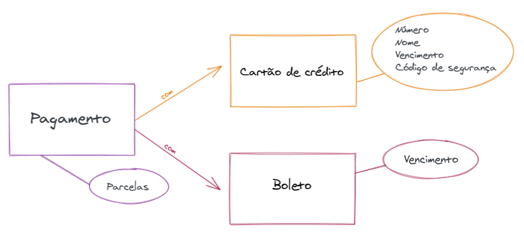

## CONSTRUÇÃO DE OBJETOS
Repositório com exemplos de códigos utilizados no workshop sobre boas práticas na construção de objetos.

### Contextualização:
No mundo da programação, quase tudo gira em torno de comunicação, escrever um bom código é primordial para ser fácil de se utilizar e manter. Com isso em mente, temos que minimizar ao máximo o risco de erros por conta de confusão no momento de evoluir o código fonte. Somando esse contexto às boas práticas de OOP, devemos sempre utilizar domínios com comportamento (evitar anti-pattern [AnemicDomainModel](https://www.martinfowler.com/bliki/AnemicDomainModel.html)). 

### Builder
Design pattern do tipo criacional utilizado para encapsular a construção de objetos complexos. 

<b>Quando utilizar</b>: Em casos em que a construção de um objeto é um pouco mais complexa por ter muitos atributos, 
atributos opcionais ou conjuntos pré-estabelecidos de atributos que devem ser informados juntos.

<b>Cenário 1 (Muitos atributos)</b>: Quando temos um objeto com muitos atributos, o construtor fica confuso de se utilizar (sendo ele uma fábrica estática ou não). Veja o código abaixo:
```java
public Pessoa(String nome, String sobrenome, String documento, LocalDate dataNascimento, String nomeDoPai, String nomeDaMae) {
...
}
```
Para utilizar este construtor, o fato de ter muitos argumentos dificulta a leitura e pode gerar confusão para uma Pessoa. Ex: O dois últimos argumentos são String (nomeDoPai e nomeDaMae), é muito fácil de trocar a ordem dos argumentos e quebrar a funcionalidade sem querer.<br>
O Builder tenta mitigar esse problema, segue abaixo um exemplo de código criando uma Pessoa com um builder:
```java
new PessoaBuilder()
        .nome("Nome da Pessoa")
        .sobrenome("Sobrenome")
        .dataNascimento(LocalDate.of(1990, 05, 02))
        .documento("11111")
        .nomeDaMae("Nome da Mãe")
        .nomeDoPai("Nome do Pai")
        .build();
```

<b>Cenário 2 (Atributos obrigatórios e opcionais)</b>: O builder acima facilita a leitura e o uso ao criar um objeto, porém, caso algum atributo seja obrigatório, não temos como garantir em tempo de compilação.
Para ajudar nisso, uma possibilidade é já ter os argumentos que são obrigatórios sendo passados na criação do builder, o código ficaria mais ou menos dessa forma:
```java
Veiculo.builder("Sandero")
                .anoFabricacao(Year.of(2016))
                .anoModelo(Year.of(2017))
                .fabricante("Renault")
                .placa("ABC-1234")
                .build();
``` 

* Uma outra forma de atacar o problema de obrigar determinados atributos a serem informados (inclusive podendo garantir a ordem em que são declarados) é utilizando um Fluent Builder Pattern, que basicamente trata de retornar tipos diferentes para cada método do builder, podendo definir um "caminho" de construção do objeto. Abaixo temos um exemplo de utilização:

<b>Cenário 3 (Sequências e "caminhos" pré-definidos - Fluent Builder Pattern)</b>: Objeto de pagamento que tem os atributos valor, vencimento (para pagamentos via boleto), nº de parcelas (quando for cartão de crédito) e os dados do cartão de crédito (número, vencimento, código de segurança, etc).

 

* Só faz sentido um pagamento que seja por cartão ou boleto, portanto, temos 2 caminhos a seguir na criação do objeto, o código abaixo exemplifica uma forma de resolver isso com Fluent Builder Pattern.
```java
public class Pagamento {
    private BigDecimal valor;
    private LocalDate vencimento;
    private CartaoCredito cartaoCredito;
    private int parcelas;

    private Pagamento() {
    }

    public static PagamentoBuilder builder() {
        return new PagamentoBuilder();
    }

    public static class PagamentoBuilder {
        private PagamentoBuilder() {
        }

        public PagamentoBoletoBuilder boleto() {
            return new PagamentoBoletoBuilder(new Pagamento());
        }

        public PagamentoCartaoBuilder cartao(CartaoCredito cartaoCredito) {
            return new PagamentoCartaoBuilder(new Pagamento(), cartaoCredito);
        }
    }

    public static class PagamentoBoletoBuilder {
        private Pagamento pagamento;

        private PagamentoBoletoBuilder(Pagamento pagamento) {
            this.pagamento = pagamento;
            this.pagamento.parcelas = 1;
        }

        public PagamentoBoletoVencimentoBuilder valor(BigDecimal valor) {
            pagamento.valor = valor;
            return new PagamentoBoletoVencimentoBuilder(pagamento);
        }
    }

    public static class PagamentoBoletoVencimentoBuilder {
        private Pagamento pagamento;

        private PagamentoBoletoVencimentoBuilder(Pagamento pagamento) {
            this.pagamento = pagamento;
        }

        public PagamentoBuilderConcluido vencimento(LocalDate vencimento) {
            this.pagamento.vencimento = vencimento;
            return new PagamentoBuilderConcluido(pagamento);
        }
    }

    public static class PagamentoCartaoBuilder {
        private Pagamento pagamento;

        private PagamentoCartaoBuilder(Pagamento pagamento, CartaoCredito cartaoCredito) {
            this.pagamento = pagamento;
            this.pagamento.cartaoCredito = cartaoCredito;
        }

        public PagamentoCartaoValorBuilder valor(BigDecimal valor) {
            pagamento.valor = valor;
            return new PagamentoCartaoValorBuilder(pagamento);
        }
    }

    public static class PagamentoCartaoValorBuilder {
        private Pagamento pagamento;

        private PagamentoCartaoValorBuilder(Pagamento pagamento) {
            this.pagamento = pagamento;
        }

        public PagamentoBuilderConcluido parcelas(int parcelas) {
            this.pagamento.parcelas = parcelas;
            return new PagamentoBuilderConcluido(pagamento);
        }
    }

    public static class PagamentoBuilderConcluido {
        private Pagamento pagamento;

        public PagamentoBuilderConcluido(Pagamento pagamento) {
            this.pagamento = pagamento;
        }

        public Pagamento build() {
            return pagamento;
        }
    }
}
```

Repare que as seguintes restrições são atendidas:
* Um pagamento via boleto não poderá receber os dados de cartão de crédito
* Um pagamento com cartão de crédito não poderá ter a informação do vencimento sendo informada
Temos essas garantias acima restringidas em tempo de compilação, ou seja, um programador não conseguirá "quebrar" essas regras nem se quiser.

<b>O fluent builder é uma solução bastante segura e útil, porém, o ponto negativo dessa abordagem é que fica bem mais verboso do que qualquer outra alternativa</b>

<br/>

##### Referências:
https://refactoring.guru/pt-br/design-patterns/builder 
  
     


